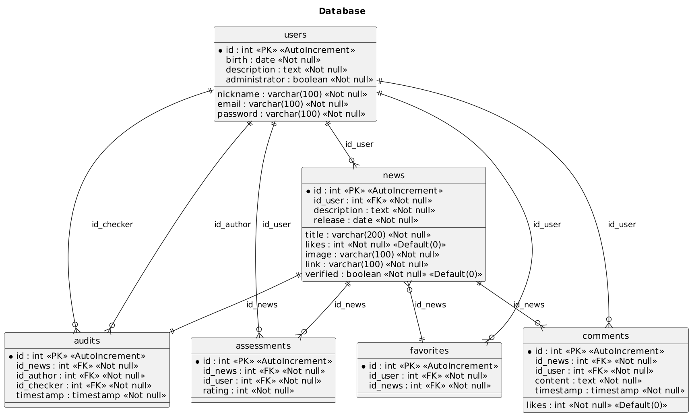

# iNFOSION

Breve descrição do projeto.



## Índice

- [Recursos](#recursos)
- [Instalação](#instalação)
- [Uso](#uso)
- [Contribuição](#contribuição)
- [Licença](#licença)

## Recursos

Descreva os principais recursos e funcionalidades do projeto aqui.

## Instalação

Explique como instalar e configurar o projeto localmente. Forneça os comandos necessários para a instalação.

# Paths
# mecanicas
- este projeto usa o padrao de arquitetura MVC
- ec6

```bash
npm install
npm run nodemon
npm run sass
